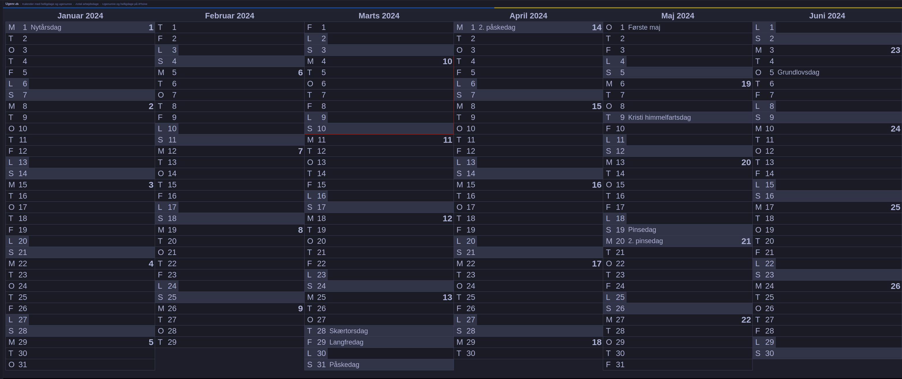

# Tech Chapter apprentice coding challenge

#### _Read this before you start!_
_At Tech Chapter we receive a lot of applications for internships from all over the country. All though we are very excited about this, we have limited capacity in interviewing all applicants. Because of this, we have decided to present all applicants with a coding challenge that will help os give a better insight in your current coding skills and to give all application similar conditions in our assessment._

_There is not a single solution for this challenge, and it is not a recuirement to complete all task. The idea is to give us a better understanding of your coding skills while you will get a better understanding of our expectations for your first time as apprentice at Tech chapter._

_The challenge is split up into 2 scenarios_
1. _A backend challenge writtin in C#.NET coding language._
2. _A frontend challenge writting in TypeScript, using React._

_C#, React / Typescript is the main programming languages used at Tech chapter. If you would like to demonstrate your skills in another way, feel free to submit code relevant that represents your skills._

_When you have finished challenge please archive and submit your solution to intern@techchapter.com along with your application, resume, public git repositories, and any grade sheets you may have._

_Happy coding ;-)_

## Introduction to the backend tasks

In this repository you will find a single tasks, Holiday Calendar

You will find a number of Interface files within the `src/`-folder along with some stub Class implementations of the Interfaces. In the `tests/`-folder you will find some [NUnit](https://docs.microsoft.com/en-us/dotnet/core/testing/unit-testing-with-nunit) test cases defined for the class implementations. Since the classes are currently stubbed the test cases will fail. Your job will be to change the class implementation to make the unit test cases pass. Once the test case passes, the task is completed in accordence with [TDD](https://en.wikipedia.org/wiki/Test-driven_development#:~:text=Test%2Ddriven%20development%20(TDD),software%20against%20all%20test%20cases.) principles.
**Note:** you should NOT do any changes to the Interface files or the test case files, but you may change or add any class implementation as you see fit.

**Hint:**
Holidays are a national mater not supported by the [GregorianCalendar](https://docs.microsoft.com/en-us/dotnet/api/system.globalization.gregoriancalendar) typically used for Calendar functionality within C#. Especially the easter can cause issues, since the days will vary from one year to the next based on the moon cycle. Also Maundy Thursday is a Holiday in Denmark but not in other countries like Sweden. Salling Group, that runs a large number of supermarkets has exposed an [API](https://developer.sallinggroup.com/api-reference#apis-holidays) of Danish holidays that may help you in succeeding this task. You will need to sign up for a token before you can start the integration.

#### Userstory 1
**AS A** bookkeeper  
**I WANT** a to know if a given day is a holiday  
**SO THAT** i know wether my colleagues must do time registration or not.  

#### Accept criteria
**Scenario: Holiday**  
**GIVEN** X-mas day: December 25th 2023
**WHEN** asking if holiday  
**THEN** return true  

**Scenario: Weekday**  
**GIVEN** regular weekday: April 21st 2023
**WHEN** asking if holiday  
**THEN** return false  

#### Userstory 2
**AS A** bookkeeper
**I WANT** a to know all holidays within a time period  
**SO THAT** I can tell my colleagues in advance  

**Scenario: Easter month**  
**GIVEN** month with easter: April 2023
**WHEN** asking for all holidays  
**THEN** return Danish national holidays: Maundy thursday, Good Friday, Easter Sunday & Easter Monday)  

## Introduction to the frontend tasks

The picture below shows the site [UgeNr.dk](https://ugenr.dk/kalender), which shows holidays in a nice calendar view. Given the [Salling API](https://developer.sallinggroup.com/api-reference#apis-holidays) which can be called to receive the Danish holidays, recreate the view from ugenr.dk.
The challenge should be created in React with TypeScript enabled using best practices for developing frontend applications.

## Holiday Calendar
#### Background
For the Tech Chapter timeregistration we need to notify employees if they forget to do their time registration. However, holidays are days off why they do not need to fill in their hours.  

**Hint:**
Holidays are a national mater not supported by moment.js, date-fns or Luxon, typically used for Calendar functionality within NodeJs and TypeScript. Especially the easter can cause issues, since the days will vary from one year to the next based on the moon cycle. Also Maundy Thursday is a Holiday in Denmark but not in other countries like Sweden. Salling Group, that runs a large number of supermarkets has exposed an [API](https://developer.sallinggroup.com/api-reference#apis-holidays) of Danish holidays that may help you in succeeding this task. You will need to sign up for a token before you can start the integration.

#### Userstory 1
**AS AN** employee  
**I WANT** an calendar overview of holidays within a date range
**SO THAT** I can better plan my upcoming holiday.

#### Accept criteria
**Scenario: Holiday**
**GIVEN** a period from January 1st 2024 to June 30th 2024
**WHEN** displaying calendar overview
**THEN** mark January 1 as New Years day
**AND** mark March 28 as Maundy Thursday
**AND** mark March 29 as Good Friday
**AND** mark March 31 as Easter Sunday
**AND** mark April 1 as Easter Monday
**AND** mark May 9 as Ascension Day
**AND** mark May 19 as Whit Sunday
**AND** mark May 20 as Whit Monday
**AND** mark June 5 as Constitution Day
